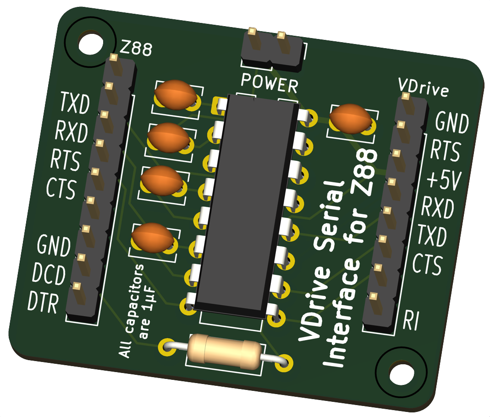

# VDrive Serial Interface Converter for Z88
Refer to [Ben Vyre's project page](https://benryves.com/products/vdrivez88) and [Github](https://github.com/benryves/VDriveZ88/) for the background.

Note that this design assumes the Z88's non-standard RS232 serial pinout so that a 1-to-1, straight through DE9 cable can be used. 

## Status
9-Aug-2025: This design is currently untested
