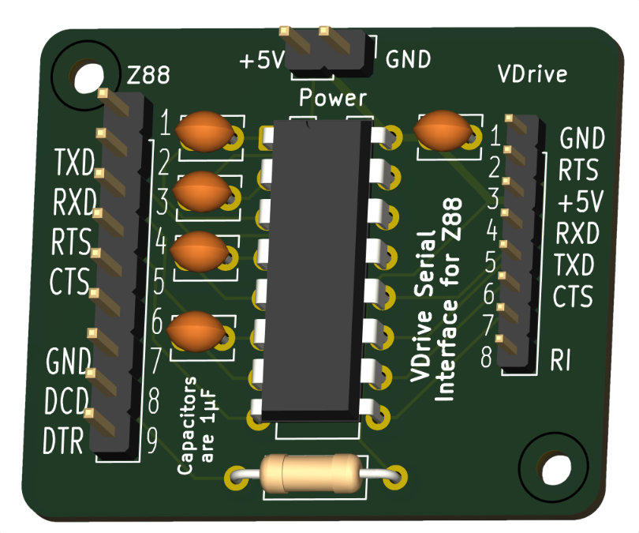

# VDrive Serial Interface Converter for Z88
Refer to [Ben Vyre's project page](https://benryves.com/products/vdrivez88) and [Github](https://github.com/benryves/VDriveZ88/) for the background.

Note that this design uses the Z88's non-standard DE9 RS232 pin numbering. 
For [standard RS232 pin numbering](https://cambridgez88.jira.com/wiki/spaces/UG/pages/35913795/Appendix+B+-+Serial+port+and+transfer+protocols): 
|Standard DE9|Z88 DE9|
|------------|-------|
| DCD (pin 1) | pin 8         |
| RXD (pin 2) | pin 3         |
| TXD (pin 3) | pin 2         |
| DTR (pin 4) | not connected |
| GND (pin 5) | pin 7         |
| DSR (pin 6) | pin 8         |
| RTS (pin 7) | pin 4         |
| CTS (pin 8) | pin 5         |
| RI  (pin 9) | not connected |

## Status
9-Aug-2025: This design is currently untested
