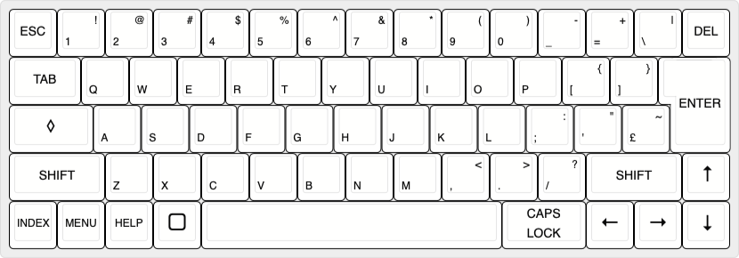

# Keyboard Design Files
## [Keyboard Layout Editor](https://www.keyboard-layout-editor.com/#/gists/f5774ed0544e4333186cfc4f175c03b7)
Files generated after designing the layout. 

## [Plate & Case Builder](http://builder.swillkb.com)
Copy the raw JSON from the layout editor to generate a plate layout & case. 
The plate layout can be imported into KiCad to simplify the key switch placement. 

