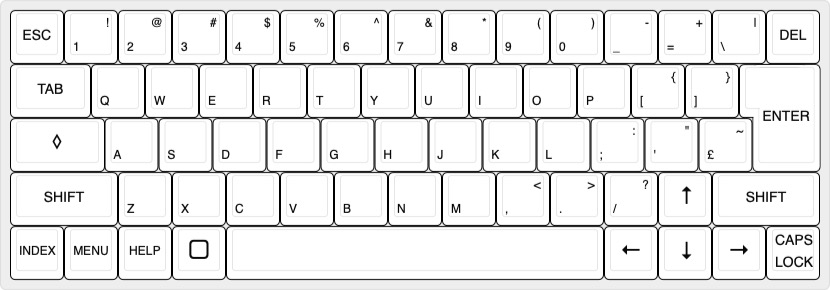

# Z88 Mechanical Keyboard
I've not had too much luck with the keyboard on my Z88 - seems a bit flaky after 40-odd years.  So I thought I'd try to create a mechanical replacement. 

I've modified the layout slightly to improve the arrangement - the cursors are now a "proper" inverted-T layout. 

## Layout
The layout almost matches a modern set of keycaps, apart from the custom ones. 
By this, I mean the SHIFTED characters on each key match a modern keyboard so a generic set of key caps, plus some blanks, should work. 

## Construction
The board is designed to use Gateron Low Profile (KS-33) type key switches with Cherry MX-style key caps. 

- 64 key switches
- 53 x 1u
- 5 x 1u blank (INDEX, MENU, HELP, SQUARE, CAPS LOCK)
- 1 x 1.25x2u (ISO ENTER)
- 1 x 1.5u (TAB)
- 1 x 1.75u (DIAMOND/blank)
- 2 x 2u (SHIFT)
- 1 x 7u (SPACE)
- Cherry stabilisers for 7u SPACE bar
- 2 x 8-pin thin film connectors (e.g. TE Connectivity/AMP 5-520314-8)
- 2 x 8-pin strips of thin film cables (e.g. Parlex PSR1635-08)

## Related Videos
- [Schematic & PCB layout](https://youtu.be/C3n-ExND1uk)
- [Track routing & final touches](https://youtu.be/aaBBvU5d50o)
- [Testing the Rev. A PCB](https://youtu.be/vxIY81ir3Ao)

## Status
1-Jul-2025: Work in progress 
3-Jul-2025: Added 6.25u space bar layout 
4-Jul-2025: Added inverted-T cursor layout 
5-Jul-2025: Inverted-T cursor design routed, ready for test fabrication 
7-Jul-2025: Design tweaked, sent to PCBWAY for test fabrication 
12-Jul-2025: Test PCBs shipped from PCBWAY 
25-Jul-2025: Test PCBs arrived, working!!, need to adjust size of PCB slightly ... maybe (see [video](https://youtu.be/vxIY81ir3Ao)) 

