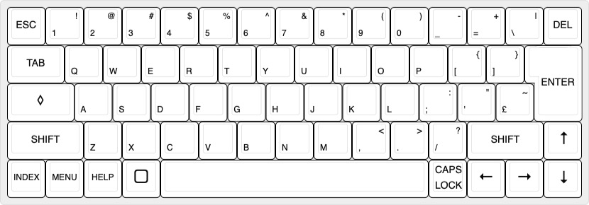
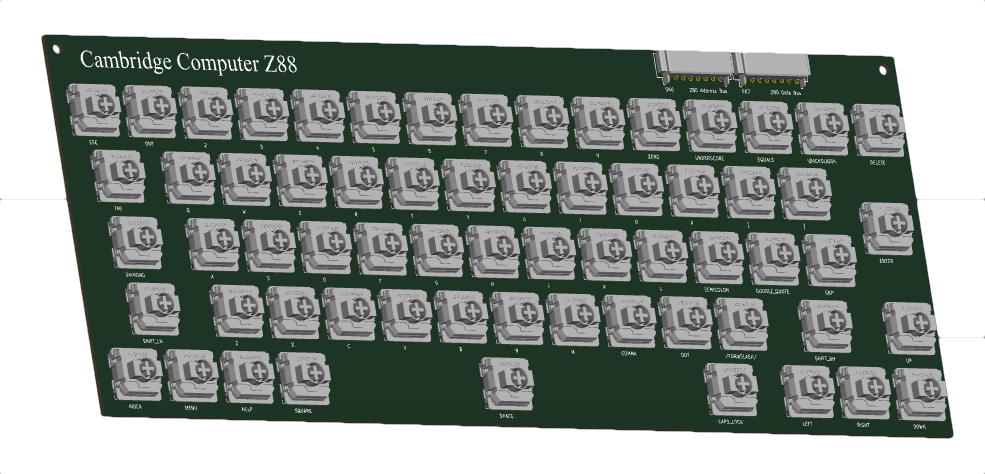

# Z88 Mechanical Keyboard
I've not had too much luck with the keyboard on my Z88 - seems a bit flaky after 40-odd years.  So I thought I'd try to create a mechanical replacement. 

Not sure if it'll work - still need to figure out the mounting points, plus also try to get it all routed. 

## Layout
The layout almost matches a modern set of keycaps, apart from the custom ones. 
By this, I mean the SHIFTED characters on each key match a modern keyboard so a generic set of key caps, plus some blanks, should work.

[Gist for keyboard design](https://gist.github.com/0ddjob/f5774ed0544e4333186cfc4f175c03b7)

## Construction
I think Gateron Low Profile (KS-33) type key switches should work.

- 64 key switches
- 53 x 1u
- 5 x 1u blank (INDEX, MENU, HELP, SQUARE, CAPS LOCK)
- 1 x 1.25x2u (ISO ENTER)
- 1 x 1.5u (TAB)
- 1 x 1.75u (DIAMOND/blank)
- 2 x 2u (SHIFT)
- 1 x 7u (SPACE)
- Stabiliser for SPACE

## Status
1-Jul-2025: Work in progress 
3-Jul-2025: Added 6.25u space bar layout 
4-Jul-2025: Added inverted-T cursor layout 
