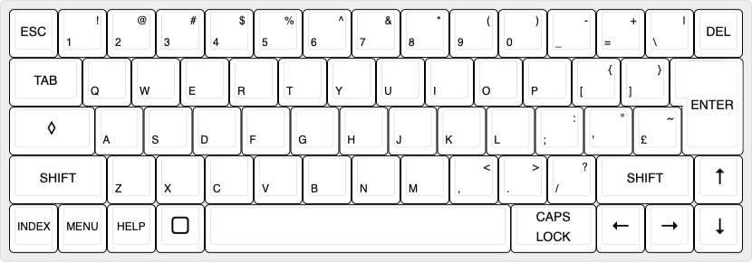

# Z88 Mechanical Keyboard
I've not had too much luck with the keyboard on my Z88 - seems a bit flaky after 40-odd years.  So I thought I'd try to create a mechanical replacement. 

Not sure if it'll work - still need to figure out the mounting points, plus also try to get it all routed. 

## Layout
The layout almost matches a modern set of keycaps, apart from the custom ones. 

- 64 key switches (Gateron Low Profile KS-33)
- 58 x 1u
- 1 x 1.25x2u (ENTER)
- 1 x 1.5u (TAB)
- 1 x 1.75u (DIAMOND)
- 2 x 2u (SHIFT)
- 1 x 7u (SPACE)

## Status
1-Jul-2025: Work in progress
