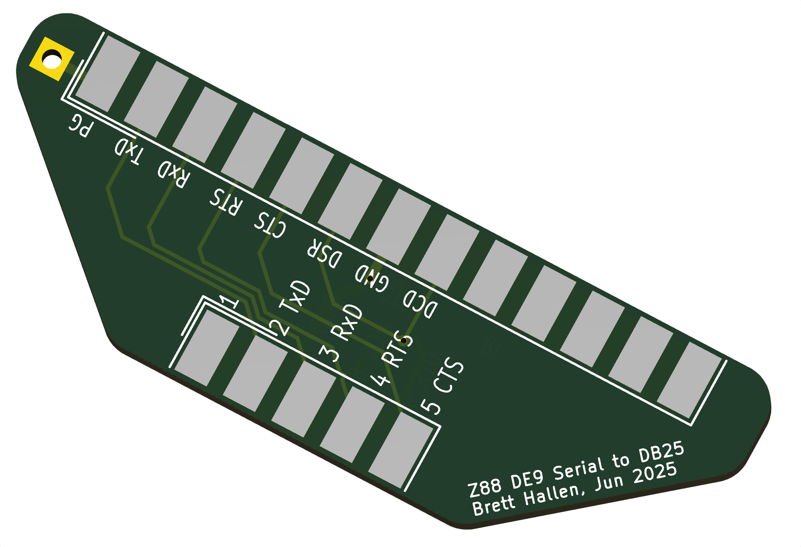

# Z88 Serial Port Converter
The Cambridge Computers Z88 has a DE9 serial port with the following [pinout](https://cambridgez88.jira.com/wiki/spaces/UG40/pages/14024777/Appendix+B+-+Serial+port):

|DE9 Pin|Signal|Purpose|DB25 Pin|
|-------|------|-------|--------|
|1|+5V|do not use|n/c|
|2|TxD|transmitted data|2|
|3|RxD|received data|3|
|4|RTS|request to send|4|
|5|CTS|clear to send|5|
|6|unknown| do not use|n/c|
|7|GND|signal ground|7|
|8|DCD|data carrier detect|6 & 8|
|9|DTR|data terminal ready|20|

To connect to a device with a DB25 plug we need to through-connect the DE9 pins to the equivalent on the DB25 side.  Additionally, we need to connect DB25 pin 6 (DSR, data set ready) to the DCD signal. 

Note that DB25 pin 1 is Protective Ground (PG) and must not be connected to signal ground. 

Z88 side: DE9 male 
DB25 side: DB25 female 

